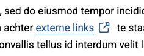
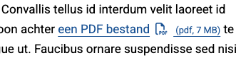

# Brave frontend kit

A modular frontend toolkit designed to help with Brave project development, including accessibility enhancements, utility functions, and easy-to-use classes.

## ✅ Installation

```bash
npm install @yardinternet/brave-frontend-kit
```

## ⚙️ Modules

### `FocusStyle`

Adds a specific class to the body when the user is navigating via keyboard (Tab key). It ensures that we can style keyboard users differently from mouse users.


#### Usage

```javascript
import { FocusStyle } from '@yardinternet/brave-frontend-kit';

// Default: initialize the FocusStyle class
const focusStyle = new FocusStyle();

// Extended usage: all options
const customFocusStyle = new FocusStyle( {
 bodyClass: 'custom-class',
} );
```

### `EnhanceExternalLinks`



Adds an icon to external links by checking if the hostname differs from the current site.

#### Usage

```javascript
import { EnhanceExternalLinks } from '@yardinternet/brave-frontend-kit';

// Basic usage
new EnhanceExternalLinks( {
  selector: '.main a',
  icon: '<i class="js-enhance-external-link-icon fa-light fa-arrow-up-right-from-square"></i>',
} );

// Extended usage: all options
new EnhanceExternalLinks( {
 selector: '.main a',
 icon: '<i class="fa-regular fa-up-right-from-square mx-2"></i>',
 excludedClasses: [ 'wp-block-button__link' ],
 excludedUrlKeywords: [ 'openpdc' ],
 insertIconBeforeText: true,
} );
```

### `EnhancePDFLinks`

Enhances `.pdf` links with a visual icon and optional file size fetched via a `HEAD` request.



#### Usage

```javascript
import { EnhancePDFLinks } from '@yardinternet/brave-frontend-kit';

// Basic usage
new EnhancePDFLinks( {a
  selector: '.main a',
  icon: '<i class="js-enhance-pdf-link-icon fa-light fa-file-pdf mx-2"></i>',
  fileSizeClass: 'js-enhance-pdf-link-file-size text-xs',
} );

// Extended usage: all options
new EnhancePDFLinks( {
 selector: '.main a',
 icon: '<i class="fa-regular fa-file-pdf mx-2"></i>',
 excludedClasses: [ 'wp-block-button__link' ],
 excludedUrlKeywords: [ 'openpdc' ],
 insertIconBeforeText: true,
 showFileSize: false,
 fileSizeClass: 'js-enhance-pdf-link-file-size text-xs',
 insertIconBeforeText: true,
  createFileSizeElement: ( bytes ) => {
   const span = document.createElement( 'span' );
   span.classList.add( 'text-xs' );
   span.innerHTML = ` (pdf, ${ Math.round( bytes / 1024 ) } KB)`;
   return span;
  },
} );
```

### `WebShareApi`

Initializes the Web Share API on a specific element and provides a function to handle the share action.

#### Usage

```javascript
import { WebShareApi } from '@yardinternet/brave-frontend-kit';

// Basic usage
new WebShareApi();

// Extended usage: all options
new WebShareApi( {
  selector: '.js-web-share-api',
} );
```

### `FacetWP`

Enhances FacetWP search pages. Adds scroll to top, aria labels, focus change on pager, hides label on filter and reset filters if no filters selected.

#### Usage

```javascript
import { FacetWP } from '@yardinternet/brave-frontend-kit';

// Basic usage
new FacetWP();

// Extended usage: all options
new FacetWP({
    selectorPrefix: 'js',
    scrollToTopOffset: 150,
});
```

## 🛠️ Utils

TBA

## 👷‍♀️ Package development

1. Run `npm link` inside this project.
2. Run `npm link @yardinternet/brave-frontend-kit` inside the project or theme. This will create a symbolic link to the project folder.
3. Run `npm run start` inside this project AND the equivalent script inside the project or theme.

## 🚀 How to publish

1. Change the version of `package.json` to the desired version and commit this change.
2. Go to [releases of the package](https://github.com/yardinternet/brave-frontend-kit/releases) and click on "Draft a new release"
3. Click "Choose a tag", type the corresponding version and press Enter. Add a title and description for the release.
4. Click "Publish release"

The Github Workflow `release-package.yml` will run whenever a release is created in this repository. If the tests pass, then the package will be published to Github packages.
