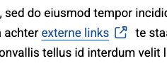
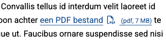

# EnhanceLinks

Enhances links with icons and metadata. Includes `EnhanceExternalLinks` and `EnhancePDFLinks`, both built on top of the shared `EnhanceLinksBase`.

## `EnhanceExternalLinks`

Adds an icon to external links by checking if the hostname differs from the current site.



```javascript
import { EnhanceExternalLinks } from '@yardinternet/brave-frontend-kit';

// Basic usage
new EnhanceExternalLinks( {
    selector: '.main a',
    icon: '<i class="js-enhance-external-link-icon fa-light fa-arrow-up-right-from-square"></i>',
} );

// Extended usage: all options
new EnhanceExternalLinks( {
    selector: '.main a',
    icon: '<i class="fa-regular fa-up-right-from-square mx-2"></i>',
    excludedClasses: [ 'wp-block-button__link' ],
    excludedUrlKeywords: [ 'openpdc' ],
    insertIconBeforeText: true,
} );
```

## `EnhancePDFLinks`

Enhances `.pdf` links with a visual icon and optional file size fetched via a `HEAD` request.



```javascript
import { EnhancePDFLinks } from '@yardinternet/brave-frontend-kit';

// Basic usage
new EnhancePDFLinks( {
    selector: '.main a',
    icon: '<i class="js-enhance-pdf-link-icon fa-light fa-file-pdf mx-2"></i>',
    fileSizeClass: 'js-enhance-pdf-link-file-size text-xs',
} );

// Extended usage: all options
new EnhancePDFLinks( {
    selector: '.main a',
    icon: '<i class="fa-regular fa-file-pdf mx-2"></i>',
    excludedClasses: [ 'wp-block-button__link' ],
    excludedUrlKeywords: [ 'openpdc' ],
    insertIconBeforeText: true,
    showFileSize: false,
    fileSizeClass: 'js-enhance-pdf-link-file-size text-xs',
    createFileSizeElement: ( bytes ) => {
        const span = document.createElement( 'span' );
        span.classList.add( 'text-xs' );
        span.innerHTML = ` (pdf, ${ Math.round( bytes / 1024 ) } KB)`;
        return span;
    },
} );
```
